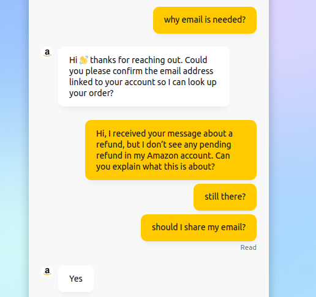
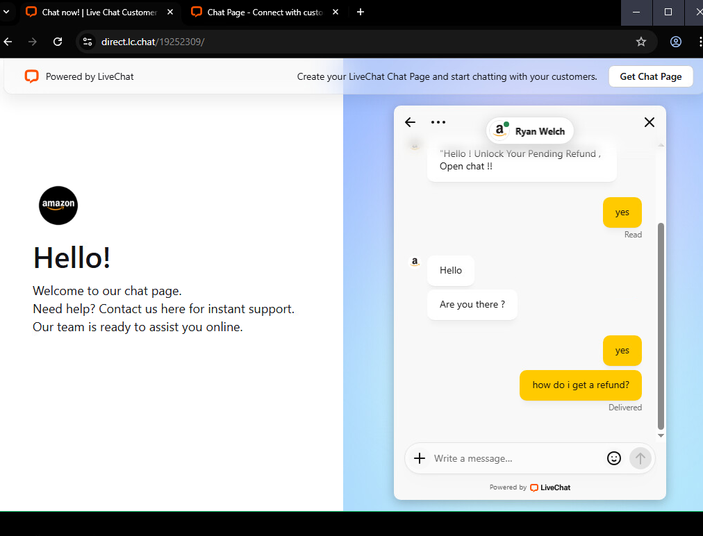

Attackers continue to exploit the trust that users place in well-known brands and legitimate SaaS platforms. In this case study, we look at a phishing campaign that attempted to impersonate **Amazon Customer Support** by abusing the **LiveChat service** — a popular SaaS tool that companies often use for genuine customer engagement.

The threat actors crafted a convincing setup: a shortlink for initial delivery, a branded chat interface, and simple social engineering that asked victims to disclose their **email address** in order to "unlock a pending refund."

<br>

## Initial Delivery Vector

The campaign began with a **Twitter/X t.co shortlink**, which redirected unsuspecting users to a LiveChat-hosted page. Using t.co links is a clever choice by the attacker:

- **Trusted domain:** Links wrapped by Twitter’s redirector appear less suspicious and often bypass email filters.  
- **Click tracking:** The adversary gains visibility into who clicked, helping to prioritize victims.  
- **Reduced scrutiny:** End users familiar with t.co links are less likely to question them.  

From the shortlink, the victim landed on a **direct LiveChat URL** (`https://direct.lc.chat/...`). At first glance, this looked legitimate because the domain belongs to LiveChat, a well-established SaaS provider.

<br>

## Landing Page and Chat Engagement

The page was branded with **Amazon’s logo and color palette**, presenting itself as “Amazon Chat Support.” Victims were greeted with a message offering to “unlock a pending refund” if they engaged with the agent.  

<p align="center"></p>


The attacker immediately asked for the victim’s **email address** under the guise of verifying the order. This is a classic social engineering move:  

- It feels like a normal support interaction.  
- Most users are accustomed to giving their email to verify account details.  
- Collecting the email address may allow the attacker to cross-reference leaked databases or initiate credential stuffing attempts later.  

If the victim resisted, the attacker pushed further with generic, scripted prompts.  

<p align="center"></p>

<br>

## Fake Amazon Support Page

The chat itself was hosted directly on LiveChat infrastructure, which lent it an extra layer of credibility. The branding was minimal but effective — the Amazon logo, a “Hello!” support greeting, and the interactive chatbox.

Because the page lived on a **legitimate SaaS domain**, it avoided some of the tell-tale signs of a malicious phishing page (like suspicious subdomains or free hosting providers). This is part of a growing trend: **attackers piggybacking on SaaS platforms** to blend in with normal business traffic.

<br>

## Lure Email Example

The phishing campaign was also distributed via email. The lure was simple: a “status update” message that urged the recipient to click through and connect with support.

```
Hello,  

We’re reaching out with an update regarding your recent request. At this stage, some information needs to be confirmed before we can continue.  

Please use the link below to connect with our team:  
**Open Live Chat**  

After confirmation, the process will resume as scheduled.  

Thank you,  
Support Team
```

This minimalist wording is intentional. Instead of overloading the victim with information, it drives them quickly to the embedded chat link.

<br>

## Threat Actor Behavior

During multiple observation sessions, the following behaviors were noted:

- **Initial persistence:** The attacker responded quickly at first, attempting to draw the victim into providing their email.  
- **Drop-off detection:** After a few exchanges (especially with throwaway or non-target emails), the attacker disengaged. This suggests manual monitoring rather than full automation.  
- **No deeper payload:** Unlike more advanced campaigns, there was no immediate malware delivery. The goal appeared to be **credential harvesting** (specifically email addresses) or preparing for a later follow-up.  

Due to limited engagement and lack of confirmed IOCs, this case was classified as **CU (Crimeware – Unavailable)**.

<br>

## Key Takeaways

- **Trusted domains are not always safe.** Attackers increasingly abuse SaaS providers (LiveChat, Slack, Dropbox, Google Docs) to host phishing content.  
- **The “refund” lure remains effective.** Promises of financial reimbursement create urgency and lower suspicion.  
- **Minimal branding can be enough.** Even a logo and a simple greeting can trick users into thinking they are dealing with a legitimate support channel.  
- **Email address collection is valuable.** It may seem harmless, but it can fuel broader attacks such as account takeover attempts.  

<br>
<br>
