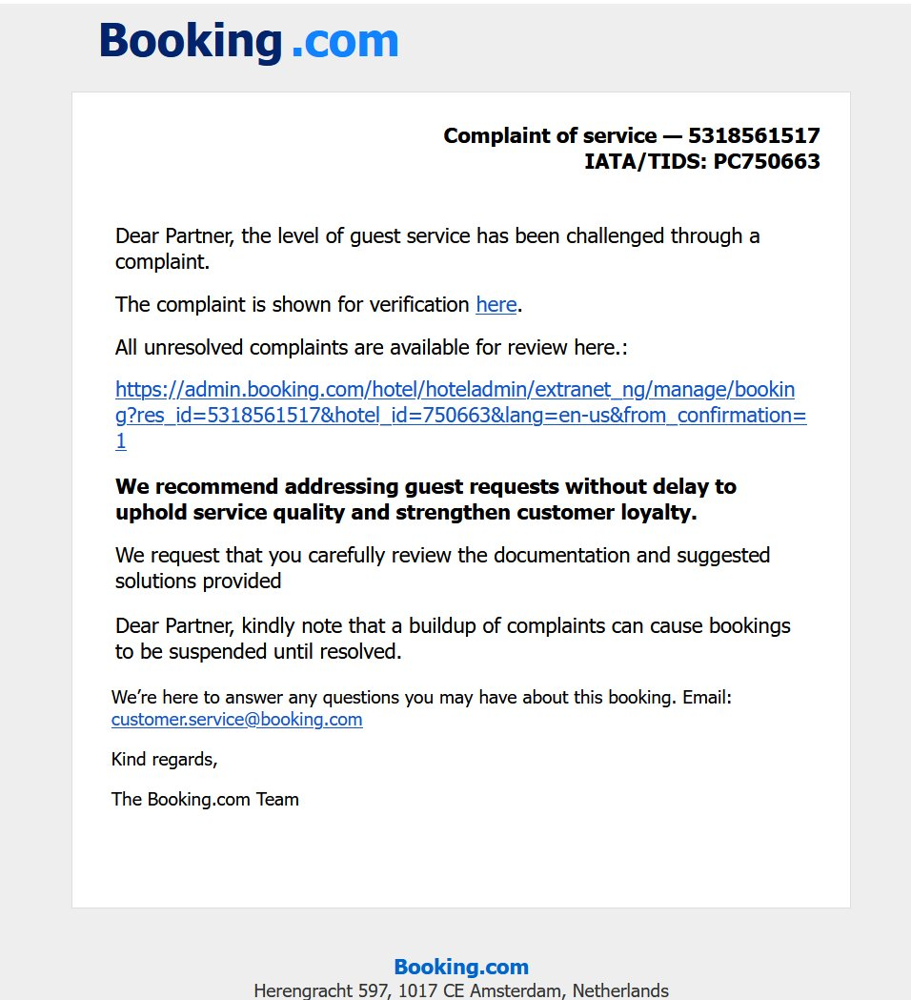
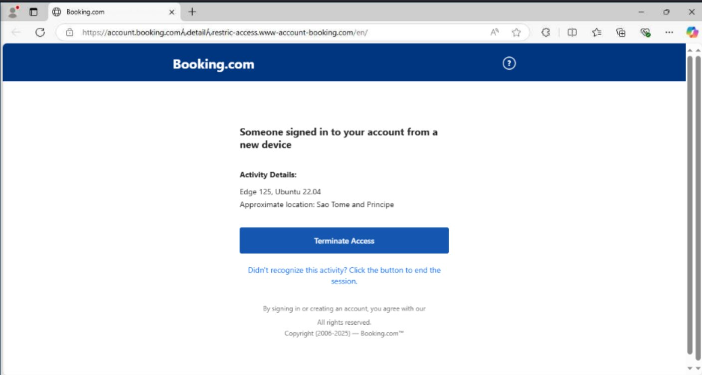

<h1 align="center">
   Masquerading with “ん” <br>
   A clever Unicode trick in Booking.com Phishing campaigns
</h1>

> **Reference:** Original finding shared by [James (@JAMESWT_WT)](https://x.com/jameswt_wt/status/1955060839569870991?s=43&t=J_U8kMSz_93ikMaUjsdWnA) on X (formerly Twitter).

One of my malware hunter contacts, **James (@JAMESWT_WT)**, recently uncovered an elegant but dangerous phishing campaign in the wild.  
While phishing pages masquerading as **Booking.com** are not new, this one uses a **Unicode character swap** that’s subtle enough to evade casual detection.

---

## The Masquerading Trick

The threat actor replaced the standard forward slash `/` in the URL path with the **Japanese hiragana character “ん” (U+3093)**.  
Visually, in many fonts and browser address bars, this **looks similar enough** to a normal character separator, but technically, it’s a completely different Unicode character.

This means that the malicious URL:

```
account[.]booking[.]comんdetailんrestric-access[.]www-account-booking[.]com/en/
```

is **not** the same as:

```
account[.]booking[.]com/detail/restric-access[.]www-account-booking[.]com/en/
```

The result?  
- **Security filters and regex-based detectors** tuned for ASCII `/` may fail to match.  
- End users **glance over the URL** and see nothing suspicious.  
- The page renders normally, further lowering suspicion.

---

## Initial Lure – The Phishing Email

The email lure is professionally done, visually matching Booking.com’s branding, with an urgent **complaint notice** or **security alert**.  
Two examples observed:
1. **Fake Service Complaint Notice** – claiming a guest lodged a complaint, urging the recipient to click a verification link.  
<p align="center"></p>
<br>
2. **New Device Login Alert** – stating someone logged in from a suspicious location, prompting the user to “terminate access.”  
<p align="center"><br></p>

Both lead to the malicious domain with the embedded “ん” character.

---

## Observed Malicious Domains

| Domain | Purpose |
|--------|---------|
| `account[.]booking[.]comんdetailんrestric-access[.]www-account-booking[.]com/en/` | Primary phishing portal |
| `www-account-booking[.]com/c[.]php?a=0` | Likely credential harvesting or intermediate data handler |
| `updatessoftware[.]b-cdn[.]net/john/pr/04.08/IYTDTGTF.msi` | Malware payload delivery (MSI format) |

---

## Technical Findings

The campaign does not stop at phishing credentials.  
The MSI payload (`IYTDTGTF.msi`) delivers a **HijackLoader** variant, further enabling the threat actor to deploy additional malicious modules.

From public threat intel sources, related samples show consistent tagging:

- **booking** (brand abuse)  
- **FakeCaptcha** (challenge page shown before final phishing page)  
- **HijackLoader** (payload)  
- File types: `.exe`, `.zip`, `.ps1`, `.msi`

A couple of example VT/Tracker entries (from first seen, to date when the blog was written):

| Seen (UTC) | SHA256 | Tags |
|------------------|--------|------|
| 2025-08-12 00:15:02 | `c583f530ad71f3f9709280dcf918a3d2604a903dad8487cf073612fb95004e8e` | exe, FakeCaptcha, RemoteManipulator, RMS |
| 2025-08-12 00:15:02 | `3c123fbd4ae250a590093cbbb718ae5adee8b551681046c7622575d496c01ae5` | booking, exe, FakeCaptcha |
| 2025-08-12 00:07:26 | `254c5fc795f3db647fcdb1a2f8e3669ba4b92801929184acc6ef1932610e05c1` | booking, ps1, FakeCaptcha |
| 2025-08-06 20:35:19 | `caf3877f85e14b20b648485b77ae01af8db4ac302a4afc55b3f751e78e2c9925` | HijackLoader, msi |

---

## Malware Behavior

Dynamic analysis of the MSI-delivered payload reveals:

- **File drop locations** within `%AppData%` and `%Temp%`
- Use of legitimate **Qt5Core.dll** and other Qt framework files to blend with legitimate software structures
- Network callbacks to C2 endpoints likely hosted behind CDN infrastructure
- Potential for credential theft and system reconnaissance

**Multi-stage attack chain:**
1. **Email lure → Fake Booking.com page** (Unicode trick)  
2. **FakeCaptcha challenge** → Credential harvest or payload trigger  
3. **MSI payload** → HijackLoader  
4. **Loader** → Further malicious modules  

---

## Why the Unicode Slash Trick Matters

This “ん” replacement is particularly dangerous because:

- Most security awareness training **teaches users to check the domain**, but not the characters between path segments.
- Filtering systems looking for `/`-separated patterns may **completely miss it**.
- Internationalized Domain Names (IDNs) have been abused before with homograph attacks, but **path-level Unicode swaps** are less discussed.

---

## Detection & Mitigation

**For defenders:**
- Normalize and sanitize URLs before scanning, convert Unicode characters to their ASCII equivalents where applicable.
- Add YARA/SIGMA rules to detect suspicious Unicode in URL paths.
- Educate users that **odd characters in URLs are a red flag**, even after the domain.

**For users:**
- Do not click links in unsolicited Booking.com (or any service) emails.
- Always navigate to the site manually by typing the URL into the browser.
- Enable MFA where possible.

---

## IOCs

**Domains:**
```
account[.]booking[.]comんdetailんrestric-access[.]www-account-booking[.]com/en/
www-account-booking[.]com/c[.]php?a=0
updatessoftware[.]b-cdn[.]net/john/pr/04.08/IYTDTGTF.msi
```

**Example Payload Hashes:**
```
c583f530ad71f3f9709280dcf918a3d2604a903dad8487cf073612fb95004e8e
a18951d6f0d053d73f4219b5a9a756c16ff2fe146909318db2e48e48a4628f5b
969d33185b13535bcf1d50d26186fdf19b5cc6a8f3071bf73180294234ae52d7
b654105ab089a9311d630112c813bc4ae9c10a8f20da6ff712edcb09599bc890
3c123fbd4ae250a590093cbbb718ae5adee8b551681046c7622575d496c01ae5
db618f90584df89beb2b1581d71602ecf4560fda58eb2267854978e645341ace
254c5fc795f3db647fcdb1a2f8e3669ba4b92801929184acc6ef1932610e05c1
e5a47d112e49c180e388809aa8c87fb58225c1548d60f8a3ed398db4eb2304b4
b8db9a72d667792b143c35bedd02bddf5bc1fd6ce680e7fa989445be3a2e7953
caf3877f85e14b20b648485b77ae01af8db4ac302a4afc55b3f751e78e2c9925
```

---

## Conclusion

James’s find is a reminder that **attackers keep innovating at the smallest detail level** — in this case, swapping a single character for a visually similar Unicode equivalent.

This campaign blends:
- Social engineering  
- Unicode obfuscation  
- Brand impersonation  
- Multi-stage malware delivery  

…into a single, well-crafted operation.

Stay alert — and remember, in cybersecurity, **every character counts**.
<br>
<br>
