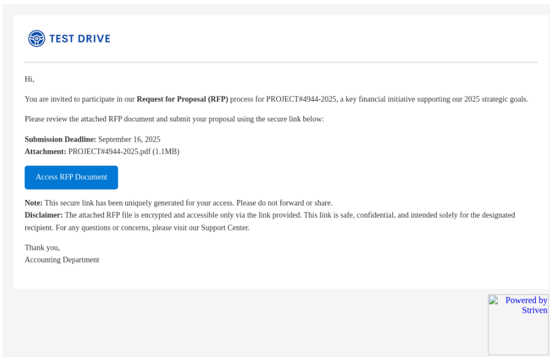
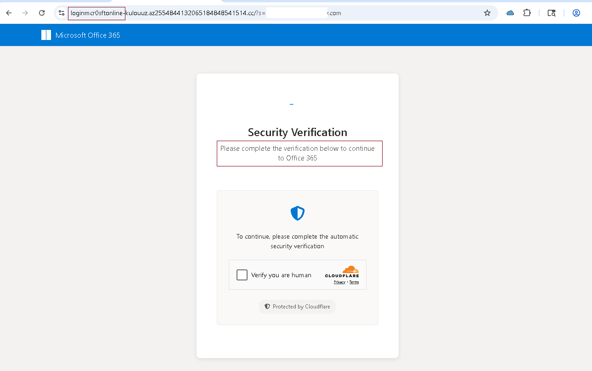
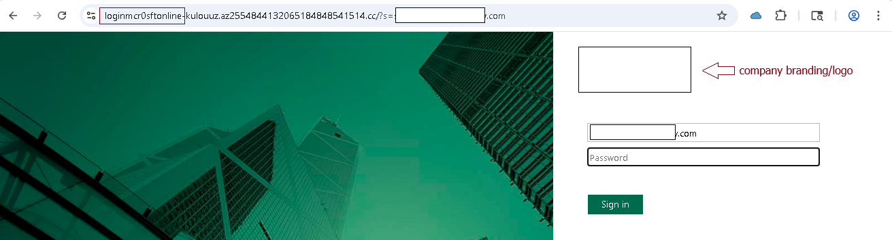

Attackers are increasingly blending corporate branding, document lures, and email templates into phishing kits that look indistinguishable from genuine business correspondence. This campaign demonstrates how a fake RFP request with embedded redirects ultimately delivers a credential harvesting page.
<br>

## Initial Lure: Fake RFP Email

The campaign starts with an email masquerading as an **Accounting Department** request for proposal (RFP) submission.  
Key features of the lure:  

- **Subject/Theme:** Business-related, “Request for Proposal (RFP)”  
- **Deadline-driven:** Submission due by September 16, 2025, to add urgency  
- **Attachment reference:** Fake PDF file (`PROJECT#4944-2025.pdf`) — but no real attachment provided  
- **Embedded link button:** “Access RFP Document”  

This email makes use of **legitimate branding** (logos and footers from a real SaaS provider), helping it bypass suspicion.  

> The **“Access RFP Document”** button contains a hidden redirect chain that eventually lands the victim on a phishing page.

---



---

## Infection Chain

Analysis of the embedded URLs reveals a **multi-stage redirect sequence**:  

### Stage 1: Infection URL

```
https://wxpaeao.clicks.mslsend.com/tj/cl/eyJ2Ijoie1wiYW... 
```

- First click leads through an email marketing/campaign service abused by the threat actor.  
- Used to obfuscate final payload delivery.  

### Stage 2: Redirect URLs

```
https://overviewsummary.powerappsportals.com/#3dc25vb...
https://links.info4tdsolutions.com/ls/click?upn=u001...
https://loginmcr0sftonIine-kulouuz.az2554844132065184848541514.cc
```

- Multiple nested redirects add complexity, make analysis harder, and evade automated filters.  

### Stage 3: Credential Harvesting Page

Victims finally land on a **Microsoft Office 365 lookalike portal**:  

- Uses **Cloudflare CAPTCHA** to feign legitimacy.  
- URL is **not Microsoft**:  
  ```
  loginmcr0sftonIine-kulouuz.az2554844132065184848541514.cc
  ```
- Notice deliberate misspelling: `mcr0sftonIine` instead of `microsoftonline`.  

---



---

## Phishing Portal

The final phishing page is styled to match **Microsoft 365 login**, including:  

- **Company-specific branding/logo** (pulled dynamically)  
- **Email pre-filled** from query string parameter  
- **Password prompt** identical to Microsoft login  

After submission, credentials are sent to the attacker-controlled endpoint:  

```
https://segv2.cc/api/login
```

---



---

## Technical Indicators

**Observed Infection URLs:**  

- `https://wxpaeao.clicks.mslsend.com/...`  
- `https://overviewsummary.powerappsportals.com/...`  
- `https://links.info4tdsolutions.com/...`  

**Observed Payload URLs:**  

- `https://loginmcr0sftonIine-kulouuz.az2554844132065184848541514.cc`  
- `https://segv2.cc/api/login` ← credential POST address  

**Observed IPs:**  

- `104.17.107.239`  
- `104.17.108.239`  
- `3.162.125.34`  
- `3.162.125.43`  

---

## Key Red Flags

- **Business-themed lure:** Exploits trust in RFP/document workflows.  
- **Deadline pressure:** Victims are pushed to act quickly.  
- **Brand abuse:** Real SaaS branding/logos for legitimacy.  
- **Lookalike domains:** `loginmcr0sftonIine[...]cc` vs. real `login.microsoftonline.com`.  
- **Multi-stage redirects:** Conceals final phishing page.  

---

## Defensive Recommendations

- **User Awareness:** Train staff to scrutinize document/RFP requests, especially those with external links.  
- **URL Inspection:** Always hover over links; look for subtle misspellings (`mcr0sftonIine`).  
- **Mail Security Controls:** Block known phishing domains and enable link rewriting/inspection.  
- **MFA Enforcement:** Even if credentials are stolen, MFA can reduce impact.  
- **Incident Response:** If credentials are entered, reset immediately and review sign-in logs for anomalies.  

---

<blockquote class="featured-quote">
Phishing campaigns like this demonstrate how convincing and targeted modern credential theft has become.  
Organizations must combine user awareness, technical controls, and strong authentication to reduce risk.
</blockquote>
