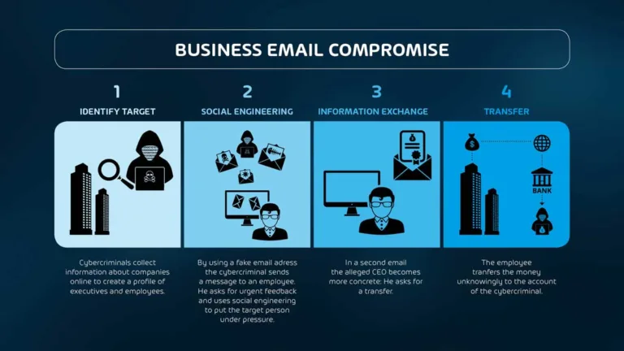
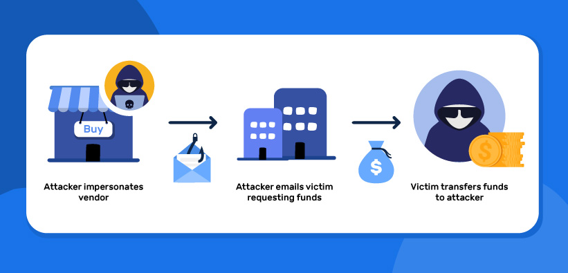
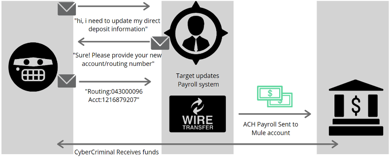
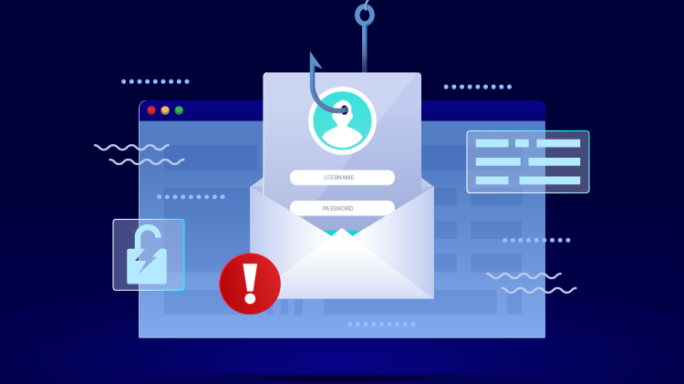

<blockquote class="featured-quote">
BEC is one of the most financially damaging forms of cybercrime today — exploiting trust, context, and timing rather than malware. In this consolidated guide, we’ll break down the major BEC attack flows, show real-world case studies, and provide detection and prevention playbooks for your teams.
</blockquote>
 

---

# BEC & Invoice Fraud Explained

Business Email Compromise (BEC) is one of the most financially damaging cyber threats.  
It doesn't rely on malware or exploits — just trust, timing, and a well-crafted email.

This section explains how BEC works, especially through invoice fraud and impersonation tactics, and how to spot it before money leaves the account.

## What Is BEC?
BEC is a targeted social engineering attack where cybercriminals impersonate a trusted party — usually a CEO, CFO, or vendor — to trick employees into:

- Sending payments to attacker-controlled bank accounts  
- Changing payroll details  
- Sharing sensitive financial data  

Unlike phishing, BEC emails are often free of links or malware. They’re clean, convincing, and personalized.

## Common BEC Variants
1. **CEO Fraud / Executive Impersonation**  
2. **Vendor Invoice Fraud**  
3. **Payroll Redirect**  
4. **Compromised Email Thread Hijack**

## Multi-Staged BEC Attacks
Attackers often draw out BEC over days or weeks, monitoring threads, mimicking workflows, and striking when payment is expected.  

### Why It Works:
- Invoice matches context  
- Branding and tone feel real  
- Multiple reinforcing emails  
- Timing is perfect  

## Real-World Example
> “Attached is our latest invoice … please note new banking details due to an audit.”  

The victim processes the payment, believing it’s genuine.

## Red Flags
- Requests to change banking info  
- Slightly altered sender domains  
- Urgent tone outside business hours  
- Thread hijacking with unexpected invoices  

## Prevention & Mitigation
- Always verify banking changes via a separate channel  
- Implement dual approvals for transfers  
- Monitor mailbox rules and spoofed domains  
- Enable DMARC, SPF, DKIM  

## Key Takeaway: Invoice Fraud
- Clean, malware-free emails  
- Executive/vendor impersonation common  
- Multi-staged, highly contextual  
- Always confirm changes via a second channel  

---

---

# BEC Vendor Hijack Case Study

A vendor email account gets compromised. Days or weeks later, the attacker strikes, right from inside the vendor's real inbox, replying in a genuine thread.

## What Happened
- Vendor’s Microsoft 365 compromised  
- Forwarding rules set up to monitor finance emails  
- PDF invoices altered with new banking details  
- Sent directly inside real threads  
- Follow-up “reminders” added credibility  

## Technical Clues Missed
- Hidden forwarding rule  
- Invoice last edited from outside IP  
- No DMARC enforcement  
- No secondary verification of banking changes  

## Lessons Learned
- Even genuine threads can be poisoned  
- Payment processes must be trusted, not just senders  
- Quiet mailbox rules are compromise signals  
- Finance teams need a payment-change checklist  

## Key Takeaway: Vendor Hijack
- Real accounts, real threads — but poisoned  
- Forwards and rules are red flags  
- Process verification is stronger than trust  

---

---

# BEC Payroll Redirection Flow

Payroll redirect scams are among the simplest but most damaging forms of BEC.  

## Typical Flow
1. HR receives a spoofed/compromised email  
2. Request: “Update my bank details immediately”  
3. Attacker-controlled account added  
4. Payroll processed — employee never receives pay  

## Email Style
Short, urgent, personal:  
> “I changed banks, please update my deposit for this cycle.”  

## Variants
- Asking process questions first  
- Using fake forms/PDFs  
- Multi-stage supervisor confirmations  

## Prevention
- Never accept banking changes over email  
- Use a secure HR portal for updates  
- Train HR/payroll teams on these tactics  
- Monitor for employee impersonation domains  

## Key Takeaway: Payroll Fraud
- Low-effort, high-damage attacks  
- Simple verification steps stop them  
- Standardized secure HR processes are essential  

---

---

# BEC Detection Playbook for SMBs

BEC is stealthy, targeted, and not easily caught by antivirus or firewalls.  
For SMBs, defense relies on **people and process**.

## Detecting Signs
- Sudden requests to change payment details  
- Emails pushing secrecy or urgency  
- Unexpected attachments or invoice edits  
- Logins from suspicious IPs  
- Hidden forwarding rules  

## Prevention Is the Best Detection
- Train finance/HR teams  
- Require dual verification for banking changes  
- Use banners for external emails  
- Block/lookout for lookalike domains  

## What to Log & Monitor
- New inbox rules  
- Foreign logins  
- Failed login attempts  
- Suspicious PDF metadata  
- Sudden MFA removals  

## Response Plan
- Payment verification checklist  
- Known-good vendor contact directory  
- Process to pause payments if fraud suspected  
- Bank escalation and insurance protocols  

## Key Takeaway: Detection Playbook
- BEC leaves behavioral clues  
- Inbox rules and logins are key indicators  
- Always confirm urgent changes with a call  
- Build a checklist and practice response  

---

<blockquote class="featured-quote">
Scams are no longer simple email tricks, they are multi-layered social engineering attacks designed to exploit urgency, trust, and emotion. In this consolidated guide, we’ve shown how BEC evolves across invoices, vendors, and payroll, and how small actions — like verification and dual approval — can stop them cold.
</blockquote>
