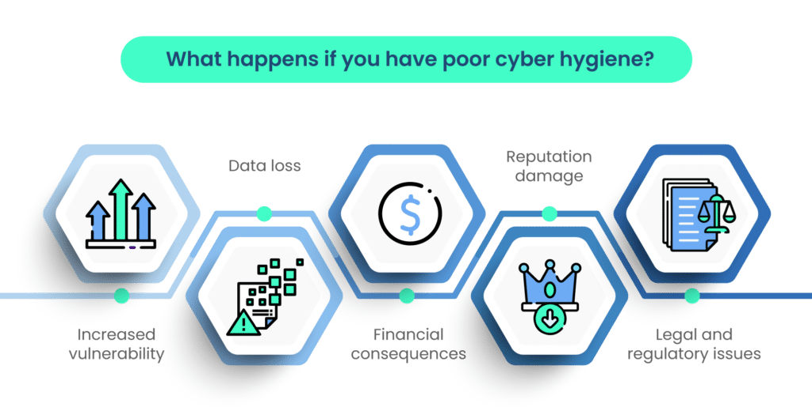

<blockquote class="featured-quote">
Strong passwords, multi-factor authentication, and software updates are not optional — they are the foundation of cyber resilience at both personal and enterprise levels.
</blockquote>
 

## Introduction

Every October, Cybersecurity Awareness Month reminds us of a basic truth: most cyberattacks succeed not because attackers are brilliant, but because defenders neglect the basics.  
The truth is simple: **strong passwords, multi-factor authentication (MFA), and timely updates block the majority of common attacks**. Yet, year after year, breaches occur because these building blocks are ignored.

In this first entry of our **Core Cyber Hygiene** series, we dive deep into why these fundamentals matter, how attackers exploit weaknesses, and the best practices to adopt for long-term safety.

---

## Passwords: Still the Weakest Link

Despite years of awareness campaigns, **passwords remain the #1 cause of breaches**. Verizon’s DBIR has consistently shown that stolen or weak credentials are involved in most data breaches.

### Common Failures
- **Password Reuse** – One password reused across dozens of sites means one breach gives attackers the keys to everything else.
- **Weak Complexity** – Attackers rely on dictionary lists and GPU cracking rigs. Even “Winter2025!” won’t hold up against modern brute force.
- **Credential Dumps** – Billions of username/password pairs circulate freely on dark web markets. Attackers constantly test these in “credential stuffing” attacks.

### Real-World Example
In 2024, attackers used leaked credentials from a breached gaming site to compromise corporate VPN accounts, bypassing perimeter defenses because employees reused personal passwords at work.

### Best Practices
- Use a **password manager** to generate and store unique passwords across every account.
- Favor **long passphrases** (e.g., “river-candle-guitar-starlight”) over short, complex strings.
- Regularly check if your credentials appear in breach databases (services like *Have I Been Pwned*).

---

## Multi-Factor Authentication (MFA)

MFA is not just a corporate requirement — it’s a personal shield against account takeovers. By requiring something you *know* (password) plus something you *have* (code, token, or biometric), MFA dramatically raises the cost for attackers.

### The Options
- **SMS Codes** – Widely available, but vulnerable to SIM swap fraud. Attackers convince carriers to transfer your number and intercept codes.
- **Authenticator Apps** – Time-based one-time passwords (TOTP) resistant to interception. Popular apps include Authy, Google Authenticator, and Microsoft Authenticator.
- **Push Notifications** – Easy but abused by “MFA fatigue attacks,” where users are spammed until they accept.
- **Hardware Security Keys** – The strongest defense, phishing-resistant and nearly impossible to bypass.

### Real-World Example
In 2023, multiple ransomware crews targeted companies with stolen credentials. In organizations without MFA, attackers logged straight in. In companies with MFA, attackers often stalled, giving defenders time to detect and contain.

### Best Practices
- Enable MFA on **all critical accounts** — email, banking, work logins, cloud storage, and social media.
- Prefer app-based codes or hardware keys over SMS.
- Train staff and family members to **never approve random MFA prompts**.

---

## Updates & Patch Management

Attackers thrive on unpatched software. Whether it’s a Windows server or a smart thermostat, vulnerabilities are the easiest entry point.

### Why Updates Matter
- **Known CVEs** – Once a patch is released, attackers reverse-engineer it to weaponize the bug.
- **Exploit Kits** – Malicious ads and sites probe for outdated browsers or plugins.
- **IoT Devices** – Routers, printers, and cameras are often ignored but just as critical.

### Real-World Example
The WannaCry ransomware of 2017 spread globally using a Microsoft SMB flaw. The patch existed months before the outbreak, but unpatched systems kept the worm alive.

### Best Practices
- Turn on **automatic updates** for OS and critical apps.
- Use centralized patch management in businesses to ensure uniform compliance.
- Keep an **asset inventory** — you can’t patch what you don’t know exists.

---

## Why It Matters

Cybersecurity is not about chasing every new threat. It is about closing the most obvious doors. Passwords, MFA, and updates may not sound exciting, but they are the three practices that **block opportunistic attackers before they even begin**.

---

<blockquote class="closing-quote">
Attackers do not always need zero-days or nation-state tools. More often, they exploit weak passwords, missing MFA, and unpatched systems. Mastering the basics blocks most of their paths.
</blockquote>
 

---
