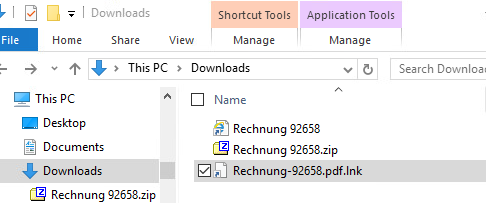
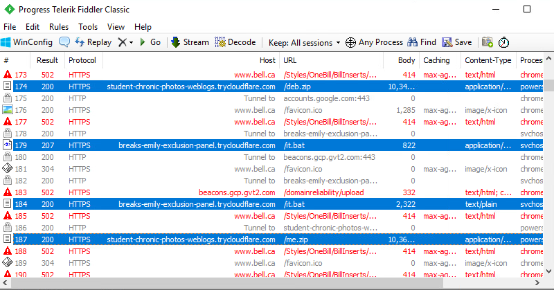
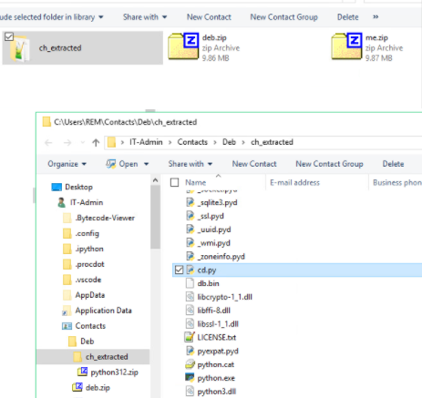
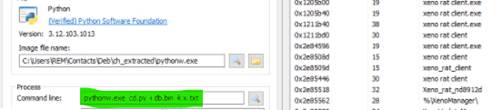
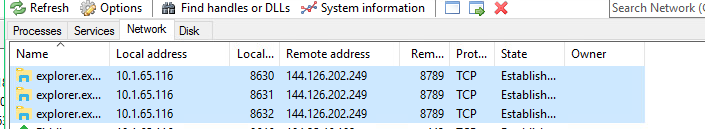

This post walks through the staged chain step-by-step, showing how a **malicious LNK file** pivots to XenoRAT. 

The chain demonstrates how **attackers adapt post-macro era tactics**:  
- Shortcut files replace Office macros.  
- WSF and PowerShell fetch self-contained Python runtimes.  
- Staging occurs in an **unexpected user folder** (Contacts).  
- Legitimate system binaries (Explorer.exe) handle **C2 comms**.  

The result: a stealthy, modular deployment of **XenoRAT** under the guise of an invoice.  

---

## The Invoice Lure

The campaign begins with a ZIP attachment named like:

```
Rechnung 92658.zip
```

Inside is a **shortcut file** (`Rechnung-92658.pdf.lnk`), disguised to look like an invoice.  

<p align="center">
  
</p>

When clicked, the `.lnk` does not open a PDF, but instead retrieves a **WSF (Windows Script File)** hosted on a disposable Cloudflare subdomain.

---

## Threat Chain in Action

The observed infection chain was:

```
URL → zip → .lnk → zub.wsf → me.zip + deb.zip → pythonw.exe → explorer.exe → C2
```

Expanded view:

1. Victim downloads and extracts ZIP.  
2. `.lnk` reaches out to:  
   ```
   https://breaks-emily-exclusion-panel[.]trycloudflare[.]com/Downloads/Rechnung-92658.pdf.lnk
   ```  
3. Fetches and executes **zub.wsf**:  
   ```
   https://breaks-emily-exclusion-panel[.]trycloudflare[.]com/at/zub.wsf
   ```  
4. WSF spawns **PowerShell**, downloading two more ZIPs:  
   - `me.zip`  
   - `deb.zip`  
5. Archives unpack into the **Contacts folder**:  
   ```
   C:\Users\[user]\Contacts\Deb\ch_extracted\
   ```  
6. Launch command observed:  
   ```
   pythonw.exe cd.py + db.bin + k.txt
   ```  
7. `explorer.exe` assumes network activity, maintaining C2 sessions.  
8. Meanwhile, the victim is shown a **fake Bill invoice page** as distraction.  

<p align="center">
  
</p>

---

## Open Directory Listings

The actor’s infrastructure is barebones: open **WsgiDAV directories** exposing payloads.  
Files seen:

| File       | Size     | Type |
|------------|---------:|------|
| `a.txt`    | 0 B      | TXT  |
| `b.txt`    | 0 B      | TXT  |
| `me.zip`   | ~10.3 MB | ZIP  |
| `deb.zip`  | ~10.3 MB | ZIP  |
| `win.bat`  | 302 B    | BAT  |

---

## Staging Under Contacts

Instead of common `AppData` or `Temp` directories, the chain **drops Python runtime and scripts under Contacts** — an unusual but stealthy choice.  

<p align="center">
  
</p>

The extracted bundle included:

- `pythonw.exe`  
- `cd.py`  
- `db.bin`  
- Multiple `.pyd` and `.dll` support files  

---

## Process Lineage & RAT Strings

Dynamic analysis shows the process tree:

```
cmd.exe → pythonw.exe → explorer.exe
```

Strings recovered from memory clearly reference **“xeno rat client”** components, handlers, and managers.

<p align="center">
  
</p>

---

## Network Activity

Explorer.exe maintains outbound TCP sessions to the attacker’s C2:  

```
144[.]126[.]202[.]249:8789
```

<p align="center">
  
</p>

This abuse of **explorer.exe as the network-facing process** is highly evasive: many defenses don’t expect Explorer to manage TCP sessions.

---

## Indicators of Compromise (IOCs)

**Domains & URLs**
```
breaks-emily-exclusion-panel[.]trycloudflare[.]com/Downloads/Rechnung-92658.pdf.lnk
breaks-emily-exclusion-panel[.]trycloudflare[.]com/at/zub.wsf
student-chronic-photos-weblogs[.]trycloudflare[.]com/me.zip
student-chronic-photos-weblogs[.]trycloudflare[.]com/deb.zip
bell[.]ca/Styles/OneBill/BillInserts/ (used as decoy)
```

**Files**
```
Rechnung 92658.zip
Rechnung-92658.pdf.lnk
zub.wsf
me.zip
deb.zip
win.bat
cd.py
db.bin
k.txt
```

**Network**
```
144[.]126[.]202[.]249:8789 (C2)
```

---

## MITRE ATT&CK Mapping

| Tactic            | Technique |
|-------------------|-----------|
| Initial Access    | T1566.002 – Phishing: Link |
| Execution         | T1204.002 – User Execution (.lnk) |
| Execution         | T1059.007 – Command & Scripting: WSF/JScript |
| Execution         | T1059.001 – PowerShell |
| Defense Evasion   | T1036 – Masquerading (invoice lure, Contacts staging) |
| Command & Control | T1105 – Ingress Tool Transfer (ZIP downloads) |
| Command & Control | T1071.001 – Application Layer Protocol: Web (via Explorer) |

---

## Detection & Mitigation

- **File-based:** Flag `.lnk` and `.wsf` inside archives; monitor Contacts folder for executables.  
- **Process-based:** Alert on `pythonw.exe` or scripts executed from unusual paths.  
- **Network-based:** Block Cloudflare subdomains serving scripts/archives; alert on Explorer.exe establishing TCP.  
- **Hardening:**  
  - Show known file extensions.  
  - Restrict script engines (`wscript`, `cscript`, `powershell`, `pythonw`).  
  - Deploy Sysmon rules for:  
    - Event 1: Explorer.exe → scripting engines  
    - Event 3: Explorer.exe network connections  

---

Defenders should tune detection around `.lnk` + `.wsf` chains, flag odd process ancestry, and watch for system binaries behaving like malware.

---
