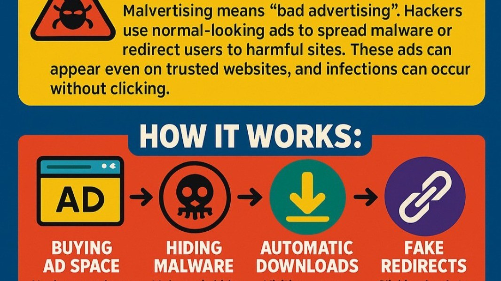

<blockquote class="featured-quote">
Malvertising is not just about shady pop-ups anymore. It is the abuse of trusted advertising ecosystems, turning Google and Bing into distribution channels for info-stealers, loaders, and ransomware. This long-form guide takes you deep into the mechanics, case studies, and defenses against malvertising in 2025.
</blockquote>
 

## Introduction

The average user believes that search engines like Google and Bing are safe gateways to the internet. After all, these companies spend billions on security, trust, and brand reputation. But attackers know something that most users do not: the **advertising layer of search engines is far easier to poison than the organic search index**.

Malvertising, short for *malicious advertising*, is the deliberate use of online ads to trick users into downloading malware. Once considered a niche threat tied to exploit kits in the early 2010s, malvertising has re-emerged as one of the **primary infection vectors of 2023–2025**. Its rise parallels the decline of email-based malware distribution, as organizations harden mail security and users grow more suspicious of random attachments.

What makes malvertising uniquely dangerous is the **trust gap**: when a user sees a “Sponsored” result at the very top of Google, they assume it is vetted. Attackers exploit this misplaced trust to deliver trojans, stealers, and ransomware at scale.

This blog provides a full-spectrum analysis of malvertising: its history, its mechanics, notable campaigns, detection challenges, and the steps users and organizations must take to defend against it.

---

## A Brief History of Malvertising

- **2007–2012: The Early Years**  
  Malvertising first appeared when attackers injected malicious Flash ads into legitimate ad networks. Victims didn’t even need to click; drive-by downloads and exploit kits did the work. Websites like Yahoo and the New York Times were inadvertently serving poisoned ads to millions.

- **2013–2016: The Exploit Kit Era**  
  Frameworks like Angler and Neutrino used malvertising as their main distribution vector. Users who simply visited a page with a poisoned ad could be infected if their browser plugins were unpatched.  

- **2017–2020: Decline with Flash and Exploit Kits**  
  As Flash was phased out and browsers hardened, traditional malvertising declined. Email phishing became the dominant delivery vector again.

- **2021–2025: The Rebirth**  
  With phishing filters improving, attackers shifted back to ads. Now, instead of drive-by exploits, malvertising uses **social engineering**: fake download sites, spoofed vendor pages, and digitally signed malware installers. It’s more convincing than ever before.

---

## How Malvertising Campaigns Operate

A modern malvertising campaign has multiple moving parts, blending marketing tactics with cybercrime infrastructure:

1. **Ad Purchase**  
   Attackers buy ads through Google Ads or Bing Ads. They often use stolen credit cards, fake business registrations, or compromised advertiser accounts.

2. **Cloaking and Filtering**  
   Ads use cloaking techniques so that Google’s automated scanners see only benign content. Cloaking servers check IP, geolocation, and even mouse movement to distinguish bots from humans.

3. **Redirect Chains**  
   Clicking the poisoned ad sends the victim through a series of disposable domains. Each hop filters out more non-target traffic, until only the desired victim reaches the final payload.

4. **Fake Landing Pages**  
   The victim sees a clone of the site they were looking for: WinRAR, Notepad++, OBS, Chrome, Zoom, or AnyDesk. HTTPS is always present, and the design is flawless.

5. **Malware Installer**  
   Instead of the real software, the user downloads a malware loader. Often the file is digitally signed, further reducing suspicion.

6. **Secondary Payloads**  
   The loader retrieves the real malware: info-stealers like RedLine and Raccoon, or full frameworks like Cobalt Strike. In enterprise environments, ransomware groups take over from here.

---

## Case Studies of Malvertising in Action

### Case 1: WinRAR and Notepad++ Fake Ads
- Attackers ran Google ads for “download WinRAR” and “download Notepad++.”  
- Victims who clicked were redirected to fake sites hosting installers for **FakeBat** and **PrivateLoader**.  
- Once executed, these loaders installed **RedLine Stealer**, harvesting browser passwords and crypto wallets.

### Case 2: Chrome Update Campaigns
- Fake “Update Chrome” ads have circulated since 2023.  
- The installers delivered **Vidar** and **Raccoon Stealer**.  
- The campaigns were notable for using **valid digital certificates**, making them appear legitimate even under Windows SmartScreen checks.

### Case 3: Remote Work Tools as Bait
- AnyDesk, Zoom, and TeamViewer have all been impersonated.  
- In one campaign, **BatLoader** was dropped, which then deployed Cobalt Strike.  
- This infection chain often led to **ransomware operations**, particularly targeting small and medium businesses that relied heavily on remote tools during the work-from-home surge.

### Case 4: OBS Studio Fake Ads
- Ads for the open-source streaming tool OBS distributed loaders tied to **Vidar** and **Lumma Stealer**.  
- Given OBS’s popularity with gamers and streamers, the campaign had a wide reach among individuals less likely to notice subtle domain differences.

---

## Technical Deep Dive

A representative infection chain demonstrates the sophistication:

- **Step 1:** Victim searches Google for “AnyDesk.”  
- **Step 2:** Sponsored result leads to `anydesk-support[.]com`.  
- **Step 3:** The domain uses HTTPS, a realistic favicon, and cloned CSS.  
- **Step 4:** Downloaded file is `AnyDesk-Installer.msi`, signed with a stolen code-signing certificate.  
- **Step 5:** Inside, **BatLoader** executes, creating persistence via scheduled tasks.  
- **Step 6:** BatLoader contacts a C2 server, downloads Cobalt Strike, and injects into memory.  
- **Step 7:** Within hours, lateral movement is observed, and ransomware payloads are staged.

The chain reveals the dual nature of malvertising: **social engineering at the entry point, technical malware deployment after execution.**

---

## Why Malvertising is So Hard to Stop

- **Sponsored Trust** – Users assume paid ads are vetted.  
- **Rapid Domain Rotation** – Campaigns use thousands of disposable domains.  
- **Code Signing Abuse** – Stolen certificates make malware appear legitimate.  
- **Cloaking** – Security scanners see only harmless decoys.  
- **Speed** – Campaigns run for days, infect thousands, and disappear before takedown.

Even advanced SOCs struggle to preempt malvertising because detection requires both URL reputation analysis and user awareness.

---

## Impact and Victimology

- **For Consumers**  
  - Password theft from browsers.  
  - Empty cryptocurrency wallets.  
  - Fraudulent purchases.  

- **For Enterprises**  
  - Compromise of employee laptops leads to lateral spread.  
  - Ransomware delivered via BatLoader or IcedID.  
  - Breach costs escalate into millions.  

- **For the Ecosystem**  
  - Google and Microsoft face criticism for slow response.  
  - Malvertising erodes trust in search engines themselves.

---

## Defense Strategies

### Individual Users
- Do not click sponsored results; scroll to the first organic link.  
- Bookmark official vendor sites.  
- Verify installer digital signatures.  
- Run downloads through reputable antivirus or sandbox tools.

### Enterprises
- Use browser extensions or policies to block ads entirely.  
- Train employees on the risks of sponsored results.  
- Deploy EDR/XDR capable of detecting loader behavior.  
- Treat software installations as security events, not routine tasks.  
- Monitor DNS queries for domains tied to ad campaigns.

### The Role of Ad Networks
- Google and Microsoft must improve vetting of advertisers.  
- Faster takedowns are essential; hours matter in active campaigns.  
- Greater transparency is needed: users should know when an ad was vetted and by whom.

---

## The Future of Malvertising

Given its effectiveness, malvertising will likely remain a dominant initial access vector. We expect to see:  
- **More AI-driven campaigns** that tailor lures in real time.  
- **Increased abuse of legitimate hosting** (e.g., GitHub, Dropbox) as final payload servers.  
- **Expansion into mobile ecosystems**, with fake ads delivering trojanized APKs.  
- **Ransomware-as-a-Service operators** increasingly adopting malvertising for scale.

---

## Key Takeaways

- Malvertising is not a relic of the past — it is one of the top threats of 2025.  
- It exploits the misplaced trust in search engines and their ads.  
- Campaigns are professional, fast-moving, and profitable.  
- Both individuals and enterprises must adapt defenses.  
- Until ad networks implement stronger controls, malvertising will remain an open highway for malware.

---

<blockquote class="closing-quote">
Malvertising demonstrates that attackers do not always need technical exploits. Sometimes, all they need is the right ad placement, a convincing landing page, and the misplaced trust of a user’s first click.
</blockquote>
 

---
