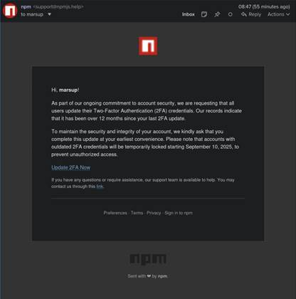

The September 2025 NPM hack wasn’t just another crypto-stealer. It was a proof-of-concept showing how fragile the open-source ecosystem really is, and how one email can ripple through billions of downloads.
<br>

## Why This Attack Matters

The modern internet is built on open-source software. From websites to banking apps, from crypto wallets to enterprise tools, developers rarely write everything from scratch. Instead, they **pull in building blocks** maintained by a global community of contributors. The **Node.js ecosystem** powers much of the internet, from banking apps to SaaS dashboards, from fintech startups to Fortune 500 enterprise software. All of that code ultimately leans on **NPM**, the Node Package Manager.   

But what happens when one of those building blocks is poisoned?   

On **September 8, 2025**, that nightmare scenario came true. Attackers compromised **18 highly popular NPM packages**, some downloaded billions of times each week, and injected malicious code. The incident is now considered the most widespread supply chain attack in NPM’s history.   


This attack wasn’t just about cryptocurrency theft. It struck at the very **trust model** of open-source software:  
- Developers trust maintainers.  
- Maintainers trust the registry.  
- Businesses trust developers.  

When that trust is broken, the entire chain collapses.

---

## What is NPM?

NPM is the **largest package ecosystem in the world**, with:  
- **Over 2 million packages** published.  
- **Billions of weekly downloads**.  
- **A critical role** in almost every modern JavaScript or TypeScript project.

Think of NPM as a **giant public library** for code:  
- You run `npm install lodash`.  
- Instantly, you get a utility library with 1,000+ prebuilt functions.  
- Your app just became smaller, faster to build, and easier to maintain.

### But there’s a hidden risk:
Every install may pull in dozens (or hundreds) of **transitive dependencies** — libraries required by your chosen library. A simple project can balloon into **hundreds of nested dependencies**, many maintained by just **one person in their free time**.

---

## How Dependency Resolution Works (Internals)

NPM resolves dependencies in three layers:  

1. **Direct dependencies** (declared in `package.json`).  
2. **Transitive dependencies** (what your dependencies depend on).  
3. **Version flattening** via `package-lock.json` (locks exact versions).  

If a malicious actor publishes a poisoned version (say, `debug@4.4.2`):  
- Anyone running `npm install` without pinning versions may fetch it.  
- That package might also flow in transitively via `chalk` or `supports-color`.  
- Your CI/CD pipeline happily builds and ships poisoned code to production.  

**Flow diagram (simplified):**

```
Maintainer → NPM Registry → Developer's npm install → Build pipeline → Production → End Users
       (phished)         (poisoned package)              (trusting "latest")
```

---

## The Phishing Lure

The attackers didn’t breach NPM itself — they **phished maintainers**.  

### The lure email


### It looks convincing, right?
- **Branding:** Used the NPM logo + formatting.  
- **Urgency:** “Update 2FA now or risk account lock.”  
- **Legitimacy:** Sent from `support@npmjs.help` (similar to official domain).  
- **Fear tactic:** Claimed outdated 2FA credentials = blocked publishing rights.  

Result? Maintainers like **Josh “qix” Junon** (author of `chalk`) entered credentials, handing attackers full control.

---

## The Attack: What Happened Next

With valid credentials, attackers published **malicious versions of 18 popular packages**, including:  

- `chalk` (5.6.1)  
- `debug` (4.4.2)  
- `ansi-regex` (6.2.1)  
- `ansi-styles` (6.2.2)  
- `supports-color` (10.2.1)  
- `strip-ansi` (7.1.1)  
- `wrap-ansi` (9.0.1)  
- `color-string` (2.1.1)  
- … and more  

Collectively, these account for **2+ billion weekly downloads**.

Within hours:  
- Over **2.5 million downloads** of malicious versions occurred.  
- CI/CD pipelines worldwide unknowingly baked malware into builds.  

---

## How the Malware Worked

The injected payload was a **crypto-stealer**. It:  
- Hooked into `XMLHttpRequest` in the browser.  
- Monitored Web3 traffic.  
- Replaced wallet addresses in Ethereum, Bitcoin, Solana, and more.  
- Redirected funds to attacker wallets.  

**A snippet of the malicious logic (simplified):**

```javascript
XMLHttpRequest.prototype.send = function (data) {
  const response = JSON.parse(this.responseText);
  if (response.includes("wallet_address")) {
    response.wallet_address = attacker_wallet;
  }
  return original_send.apply(this, arguments);
};
```

Attackers even wrote regex patterns to detect **crypto addresses** across multiple blockchains.

---

## Impact Assessment

- **2.5M+ downloads** of compromised versions.  
- **$500 stolen in crypto** (small only because detection was fast).  
- **Risk of massive supply chain fallout** if detection was delayed.  
- **Reputational hit** for NPM and maintainers.  

What saved the day?  
- Attackers used a **well-known obfuscator** (`javascript-obfuscator`) → defenders spotted it quickly.  
- Wallet monitoring flagged anomalies.  

---

## Alternate Scenario: What If It Went Undetected?

If unnoticed, this could have:  
- Infected **wallet apps, exchanges, and dApps**.  
- Redirected **millions in crypto**.  
- Exfiltrated **API tokens, secrets, and credentials** from enterprise apps.  
- Triggered a **cascading trust crisis** across the entire JavaScript ecosystem.  

---

## Historical Context: This Isn’t New

- **event-stream (2018):** Malicious update stole Bitcoin wallets.  
- **UAParser.js (2021):** Account hijack → credential stealer malware.  
- **colors & faker (2022):** Maintainer sabotage broke builds globally.  
- **s1ngularity (2025):** AI-driven workflow injection in NPM packages.  

The 2025 incident is **the largest by scale** — but far from the first.

---

## Defensive Practices

### For Developers
- Pin dependencies with `package-lock.json`.  
- Scrutinize obfuscated code.  
- Enable 2FA + hardware keys.  

### For Organizations
- Use **Software Composition Analysis (SCA)**.  
- Generate **SBOMs** (CycloneDX, SPDX).  
- Integrate dependency checks into CI/CD.  
- Rotate credentials after incidents.  

### SBOM Example
```bash
# Generate SBOM with CycloneDX tool
npm install -g @cyclonedx/cyclonedx-npm
cyclonedx-npm --output-file sbom.json
```

### For Crypto Users
- Use **hardware wallets**.  
- Avoid in-browser approvals during crises.  
- Verify addresses before sending funds.  

---

## Other Ecosystems: Same Risk

NPM isn’t alone.  
- **PyPI (Python):** Typosquatting & credential stealers.  
- **RubyGems (Ruby):** Credential-stealing gems.  
- **Maven (Java):** Dependency confusion attacks.  

All ecosystems share the same fragility: **trust in small maintainers at scale**.

---

## Key Takeaways

- **One phish = billions exposed.**  
- **Dependencies = attack surface.**  
- **SBOMs & SCA = must-haves, not nice-to-haves.**  
- **Open-source maintainers are critical infrastructure.**  

- **Trust but verify:** Every dependency is a risk surface.  
- **Phishing works:** Human error can undo technical security.  
- **Scale matters:** One poisoned package = billions exposed.  
- **Security culture:** Treat OSS maintainers like critical infrastructure.  


---

## Final Word

The September 2025 NPM attack could have rewritten supply chain history — and nearly did.  

It’s proof that:  
- The weakest link in global software security may be one developer’s inbox.  
- Supply chain attacks are **the future of cybercrime**.  
- Defense requires cultural, not just technical, change.  

---

<blockquote class="featured-quote">
Audit, verify, secure — because the foundation of the internet is only as safe as the trust we put in it.
</blockquote>
