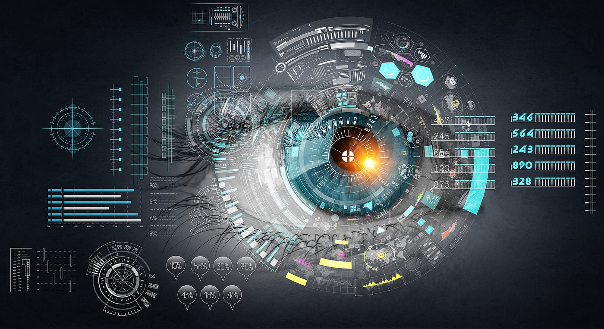

<blockquote class="featured-quote">
OSINT isn’t hacking .. it’s assembling intelligence from what’s already public. And few things spill more data than the billions of photos and videos we upload every single day.
</blockquote>
<br>



## What is OSINT?  
**OSINT (Open-Source Intelligence)** is the practice of collecting and analyzing data that’s already public. This isn’t about breaking into systems or stealing secrets .. it’s about finding clues in plain sight.  

Sources of OSINT include:  
- Websites, blogs, and cached content.  
- Social media posts, stories, and interactions.  
- Photos and videos uploaded to the internet.  
- Public records, databases, leaks, and forums.  
- Satellite maps, flight trackers, and ship trackers.  

**Why it matters:**  
- **For defenders** – OSINT helps uncover threats and verify events.  
- **For attackers** – OSINT is often the first step in profiling a victim.  


## Why Start with Image OSINT?  
We’re in a **visual-first world**. Instagram, TikTok, and Facebook are flooded with photos and videos every second.  

Images have **two layers** of intelligence:  
1. **Visible clues** – What you see: backgrounds, logos, signs, weather, clothing.  
2. **Invisible data** – What you don’t see: metadata, GPS tags, device info.  

That’s why analysts (and scammers) love **image OSINT**: a single selfie might reveal your identity, location, and routine.  

---

## Technique 1: Reverse Image Search  

### How It Works  
Upload or paste an image into a reverse search engine. It looks for matches across the web—identical copies, cropped versions, or visually similar images.  

### Tools You Can Use  
- **Google Lens** – quick, built into Chrome and Android.  
- **Yandex Images** – excellent for faces and Russian-language sources.  
- **TinEye** – useful for tracking *oldest appearances*.  

### Step-by-Step Demo  
1. Save or copy an image you want to check.  
2. Open [Google Images](https://images.google.com).  
3. Click the camera icon → upload image / paste URL.  
4. Review results.  

### Real Case Example  
- A romance scammer sends a “personal” selfie.  
- Reverse image search reveals the same photo belongs to a model’s Instagram.  
- In seconds, the scammer is exposed.  

### Key Tip  
- **Public:** Run reverse searches on strangers’ profile pics.  
- **Analysts:** Use oldest result (via TinEye) to establish timeline and origin.  

---

## Technique 2: Metadata Extraction (EXIF Data)  

### How It Works  
Most photos store hidden **EXIF metadata**:  
- Camera make & model  
- GPS coordinates (longitude/latitude)  
- Date/time  
- Editing software  

If not stripped, EXIF data can be a goldmine.  

### Tools You Can Use  
- **ExifTool** (CLI, professional-grade).  
- **Metadata2Go** (online).  
- **FotoForensics** (visual breakdowns).  

### Step-by-Step Demo with ExifTool  
1. Save a photo locally.  
2. Run the command:  

```bash
exiftool vacation.jpg
```

Sample output:  
```text
File Name                       : vacation.jpg
Make                            : Apple
Model                           : iPhone 14 Pro
Date/Time Original              : 2025:07:04 18:25:42
GPS Latitude                    : 34 deg 0' 24.00" N
GPS Longitude                   : 118 deg 29' 59.00" W
```

3. Paste the GPS coordinates into Google Maps.  
4. Now you know exactly where the photo was taken.  

### Real Case Example  
- A scammer “abroad for work” sends a photo.  
- EXIF shows it was taken in their home suburb.  
- Lie exposed.  

### Key Tip  
- **Public:** Disable “location tagging” in your phone’s camera settings.  
- **Analysts:** Even stripped EXIF data leaves fingerprints (like editing software).  

---

## Technique 3: Deepfake & Manipulation Detection  

### The Problem  
Deepfakes use AI to create **synthetic images/videos** of real people. Attackers use them to:  
- Impersonate CEOs in fraud.  
- Spread propaganda.  
- Run dating/romance scams.  

### How to Spot Them  
- Unnatural **eye blinking or lip sync** in video.  
- Lighting/shadow inconsistencies.  
- Background objects blurred or mismatched.  
- Asymmetry in facial features.  

### Tools You Can Use  
- **InVID** – breaks videos into frames for forensic checks.  
- **Deepware Scanner** – detects AI-generated content.  
- **Amped Authenticate** – professional forensic analysis.  

### Step-by-Step Demo with InVID  
1. Copy a suspicious video URL.  
2. Upload it into [InVID](https://www.invid-project.eu/tools-and-services/invid-verification-plugin/).  
3. Generate keyframes → run reverse searches on each frame.  
4. Look for mismatches: e.g., same “CEO” face reused across multiple scam videos.  

### Real Case Example  
In 2020, criminals impersonated a company CEO on a deepfake video call, tricking staff into wiring **$243,000**.  

### Key Tip  
- **Public:** Be cautious of “video proof” during urgent money requests.  
- **Analysts:** Add AI detection tools into your standard OSINT workflow.  

---

## Why It Matters  
- **Everyday users**: A simple selfie could give away your home, your work, or your travel.  
- **Analysts**: Photos/videos are often the first pivot—leading from one account to a larger network.  

Image OSINT bridges **personal safety** and **professional threat intelligence**.  

---

## Key Takeaway  
A photo isn’t just an image. It’s data.  
- Reverse search shows where it’s been.  
- Metadata shows when/where it was taken.  
- Forensic checks show if it’s real or fake.  

By practicing Image OSINT, you protect yourself from scams **and** sharpen your skills as an investigator.  

---

**Up Next:**  
[OSINT Pt.2: TikTok, Facebook & Instagram OSINT – Location clues, trends & impersonation risks]({{ "/listings/osint-social-media" | relative_url }})  

---
