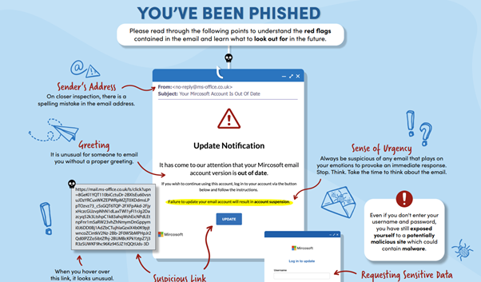
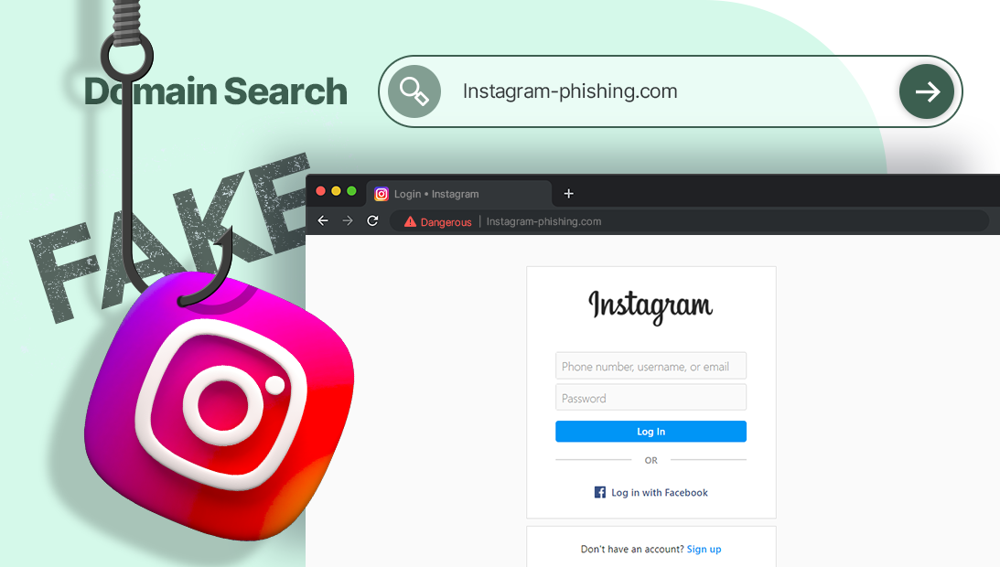
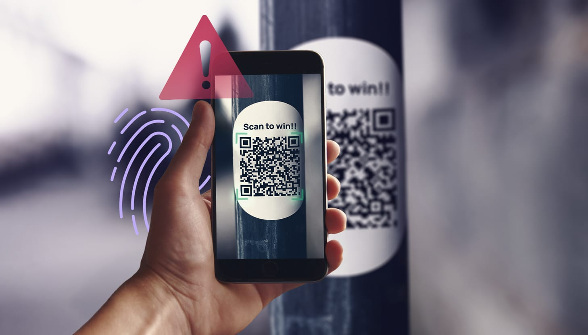

<blockquote class="featured-quote">
Phishing isn’t just “bad emails.” It’s a full attack chain that plays on urgency, trust, and routine. This guide centralizes what staff and everyday users actually face: shady messages, pixel-perfect fake portals, and QR-code bait. Each section mirrors real life with examples, red flags, and precise actions to stay safe.
</blockquote>
 

# Phishing Red Flags — How to Spot a Trap

Phishing succeeds because it targets people, not systems. Whether via **email**, **SMS**, **messengers**, or **LinkedIn**, most campaigns reuse the same psychological levers.

---

## How It Hooks You

1. **Urgency or Fear**  
   *“Your account will be suspended in 24 hours”* → Forces instant reaction.
2. **Authority & Familiarity**  
   Branded logos, “IT Admin,” “Bank Support,” or “Government” veneer.
3. **Convenience**  
   One-click buttons, QR codes, or shortened links reduce scrutiny.

---

## Red Flags to Watch

- **Sender mismatch**  
  Display name says *Microsoft Support*, but the real address is `alerts@microsof-tsecure.co`.
- **Language & tone**  
  Awkward phrasing: *“You are require to updated your informations.”*
- **Suspicious links**  
  Link text is fine, hover reveals `https://secure-payments.mybank.com.fakeurl.ru`.
- **Unexpected attachments**  
  `.docm`, `.xlsm`, `.js`, `.vbs`, `.scr` (often inside ZIPs).
- **Data or money requests**  
  Credentials, MFA codes, gift cards, crypto, or “refund processing fees.”

**Quick Checks**
- Hover links (desktop) / long-press (mobile) to preview the true URL.  
- Expand sender details — inspect the full domain, not just the name.  
- If it’s urgent, **don’t click** — open a known bookmark and sign in there.

---

## Real-World Example

> **Subject:** [Action Required] Office365 Password Expiration  
> Your password will expire in 12 hours.  
> Please verify your account: `https://office365support-authenticate.net/login`  
> – IT Admin

**Why it’s a phish:** Non-Microsoft domain, invented urgency, generic sign-off, no prior notice.

---

## What To Do If You Suspect Phishing

1. **Do not click, reply, or open attachments.**  
2. **Report** to your IT/Sec team (or forward to `reportphishing@apwg.org`).  
3. If you clicked, **change your password** and ensure **MFA** is on.  
4. Consider a quick endpoint scan to be safe.

---

## Key Takeaway — Message Red Flags

- Odd sender/domain or display-name spoofing  
- Urgent/fear-based language  
- Typos, tone off, inconsistent branding  
- Hovered link doesn’t match the claimed site  
- Attachments you weren’t expecting  
- Requests for credentials, payment, or MFA codes  

---

# Fake Login Portals — Pixel-Perfect Credential Traps

The email is just the bait. The real trap is often a **cloned login page** designed to harvest usernames, passwords, and even MFA tokens.

---

## How Attackers Build Them

- **Site cloners** (HTTrack, `wget`) copy the real look & feel.  
- **Proxy kits** (Evilginx2, Modlishka) relay to the real site and snatch credentials/MFA in real time.  
- **Injected popups** via malicious extensions or compromised pages mimic “session expired” prompts.

---

## Common Delivery Methods

| Vector                 | What You See                                   | What’s Really Happening                         |
|------------------------|-------------------------------------------------|-------------------------------------------------|
| Email link             | `https://login-outlook-authenticate.com`       | Clone on attacker’s domain                      |
| QR code poster         | “Scan to check in / verify MyGov”              | Redirect to fake gov/SSO portal                 |
| Browser popup          | “Session expired. Login to continue.”          | Injected HTML asks for credentials              |
| MFA relay              | “Enter the code” (after password)              | Attacker proxies and captures the MFA token     |

---

## Six Clues You’re on a Fake Page

1. **URL off by a bit** (`-auth`, `-verify`, `.xyz`, or misspells).  
2. **Certificate issues** (no 🔒 or warning flags).  
3. **Design drift** (fonts, spacing, footer links slightly wrong).  
4. **Unexpected login prompts** from emails/QRs.  
5. **Multiple credential prompts** (asks twice).  
6. **Laggy/unreliable behavior** (cheap hosting, broken images).

**Pro Tip:** Password managers **won’t autofill** on impostor domains — take that as a hard stop.

---

## What To Do

- Manually type the known domain (bookmarks > search results).  
- Use **app-based MFA** where possible.  
- Report the phishing URL to IT/Sec to get it blocked org-wide.

---

## Key Takeaway — Portal Red Flags

- Domain isn’t exactly right  
- Cert warnings / no lock icon  
- Visual inconsistencies vs the real site  
- Login appeared after a random email/QR  
- Requests password **and** MFA in one flow  
- Slow or glitchy behavior

---

# QR Code Phishing (Quishing) — “Scan to Be Scammed”

QR codes are convenient — and abusable. They hide the URL until after you’ve scanned, often on **mobile**, where inspection is harder.

---

## Why It Works

- **Bypasses filters** (it’s just an image in an email/poster).  
- **Small screens** make domains harder to verify.  
- **Contextual trust** (restaurants, offices, deliveries) disarms users.

---

## Real-World Patterns

| Attack Type        | Example Message / Placement                         | Result                         |
|--------------------|------------------------------------------------------|--------------------------------|
| Email with QR      | “Scan to verify Microsoft login”                     | Opens phishing site on phone   |
| Office poster      | “Mandatory training — scan here”                     | Fake SSO portal                |
| Delivery label     | “Track your package”                                 | Payment/credential theft       |
| Business card      | “Scan for contact info”                              | Redirect to malicious site     |

---

## Red Flags & Mobile Checks

- Email contains only a **QR image** (no normal links).  
- **Random posters** with QR in shared/public spaces.  
- **Shortened/masked** URLs after scan.  
- **Immediate login/payment** prompts.  

**Mobile tip:** After scanning, **long-press** the link preview to inspect the full domain before opening.

---

## What To Do

- Avoid scanning QR codes from posters/emails unless verified.  
- For corporate devices, prefer **mobile traffic inspection** and domain allow-lists.  
- Run periodic **“spot the fake”** awareness drills (safe vs suspicious posters).

---

## Key Takeaway — QR Cheat Sheet

- Don’t scan untrusted QR codes  
- Always preview the URL before tapping  
- Never log in or pay from a QR link you didn’t initiate  
- Short links + odd domains = walk away  
- Report suspicious QR posters or emails

---

# Final Thoughts

Phishing evolves, but the defenses stay simple: **pause**, **verify**, **report**, **protect**.  
Use password managers, enable MFA, and treat unexpected prompts — email, portal, or QR — as hostile until proven safe.

<blockquote class="featured-quote">
Share this guide with colleagues, friends, and family. Awareness is your strongest first line of defense.
</blockquote>
