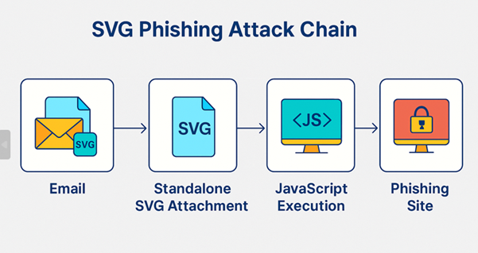

<h1 align="center">
   Unmasking the SVG threat  
   How Hackers use vector graphics for Phishing attacks
</h1>

## Introduction

The humble image file has long been considered one of the safest attachments a user can receive. While office documents, executable files, and even PDFs have well-documented risks, images are often overlooked as a potential attack vector.  

But in recent years, attackers have increasingly weaponized **Scalable Vector Graphics (SVG)** files as a delivery mechanism for phishing attacks. Unlike static image formats such as JPG or PNG, SVG is built on XML — making it not only an image format, but also a container capable of holding **executable code**.  

This dual nature is what makes SVG such a compelling choice for cybercriminals: it looks harmless, behaves like an image when viewed, but can execute malicious scripts without the victim realizing what’s happening.  

---

## Understanding SVG Files

SVG (Scalable Vector Graphics) is an **open standard** used to describe two-dimensional vector graphics. It’s widely used for:
- Web icons and logos that scale without losing quality
- Interactive charts and diagrams
- Animations and responsive designs

From a technical standpoint, SVG files are **XML documents**. This means they can contain:
- **Vector shapes and paths** for the image content
- **CSS stylesheets** for appearance
- **JavaScript** for interactivity and animation
- **Hyperlinks** pointing to other resources

These features are powerful for legitimate developers but equally attractive to attackers looking to embed malicious logic into what appears to be “just an image.”

---

## How Attackers Weaponize SVG

The attack relies on the fact that **browsers render SVG natively** and execute any embedded JavaScript without prompting the user for confirmation.  

Common malicious techniques include:

1. **Embedded JavaScript Redirection**  
   The SVG contains JavaScript that automatically redirects the victim’s browser to a phishing website when opened.

2. **Data URI Encoding**  
   Malicious scripts are embedded as base64-encoded payloads within the SVG file, bypassing basic content scanning.

3. **Hyperlink Abuse**  
   An SVG image can be clickable, linking directly to an attacker-controlled domain that hosts a credential-harvesting page.

4. **Iframe Injection**  
   Some malicious SVGs embed iframes that display phishing pages directly within the SVG rendering.

5. **File Obfuscation**  
   Attackers often obfuscate JavaScript inside the SVG to evade signature-based detection.

---

## The SVG Phishing Attack Chain

The process generally follows four key stages:

### 1. Email Delivery
Attackers send a phishing email with an SVG file attached, or a link to download it from a hosted location.  
The email is crafted to appear legitimate — referencing familiar brands, trusted senders, or urgent requests.

### 2. Standalone SVG Attachment
The victim opens the attachment, expecting an image. The SVG renders correctly but contains embedded code that is triggered immediately upon viewing.

### 3. JavaScript Execution
Once opened in a browser or any application that supports SVG rendering, the embedded JavaScript executes.  
This script might:
- Redirect the user to a phishing site
- Display a fraudulent login page
- Load malicious content from an attacker-controlled domain

### 4. Phishing Site
The victim is presented with a counterfeit website closely mimicking a legitimate service (e.g., corporate email portal, cloud storage). Any entered credentials are captured by the attacker.

---

## Why This Tactic Works

- **Trusted File Extension**  
  Many users and even some security tools perceive `.svg` files as “safe images,” leading to lower suspicion.

- **Email Gateway Evasion**  
  Basic email security systems may not fully parse or sanitize SVG content, allowing malicious code to pass through.

- **Cross-Platform Compatibility**  
  All major web browsers support SVG rendering and JavaScript execution inside SVGs.

- **Low User Awareness**  
  Few end-users (and some IT staff) are aware that an “image” can contain executable code.

---

## Challenges in Detection

Detecting malicious SVG files isn’t always straightforward:
- **Signature Evasion**: JavaScript code can be obfuscated or dynamically loaded from external sources.  
- **Encoding Tricks**: Attackers often use base64 or gzip compression to hide malicious payloads.  
- **Legitimate Use Overlap**: Many legitimate SVGs contain JavaScript for interactivity, making it harder to distinguish malicious intent without deep inspection.  

---

## Defensive Measures

To mitigate the risk of SVG-based phishing attacks, organizations should adopt a layered defense approach:

### 1. Email Security Controls
- Block or quarantine incoming SVG attachments unless explicitly required.
- Use advanced attachment scanning that parses XML and JavaScript within SVGs.

### 2. Browser and Rendering Restrictions
- Disable JavaScript execution within SVGs at the application or browser level where possible.
- Implement Content Security Policy (CSP) rules to limit where scripts in SVGs can load from.

### 3. Endpoint Protection
- Deploy endpoint security solutions capable of analyzing SVG content.
- Use sandboxing to detonate suspicious files in a controlled environment.

### 4. User Awareness
- Train staff on the risks of opening unexpected attachments, regardless of file type.
- Encourage verification of any unexpected email with an attachment before opening.

### 5. Incident Response
- Treat any suspicious SVG interaction as a potential security incident.
- Have clear procedures for isolating affected systems and investigating potential credential theft.

---

## Conclusion

SVG-based phishing is not a theoretical threat — it’s an increasingly common tactic that blends technical exploitation with social engineering. By leveraging a file format most people trust, attackers gain a valuable advantage in bypassing defenses.  

Understanding the **SVG phishing attack chain** is the first step in defending against it. Organizations should update their email filters, security awareness training, and endpoint defenses to account for this evolving threat vector.  

The days of treating images as inherently safe are over — vigilance and layered defenses are now essential.
 
 
